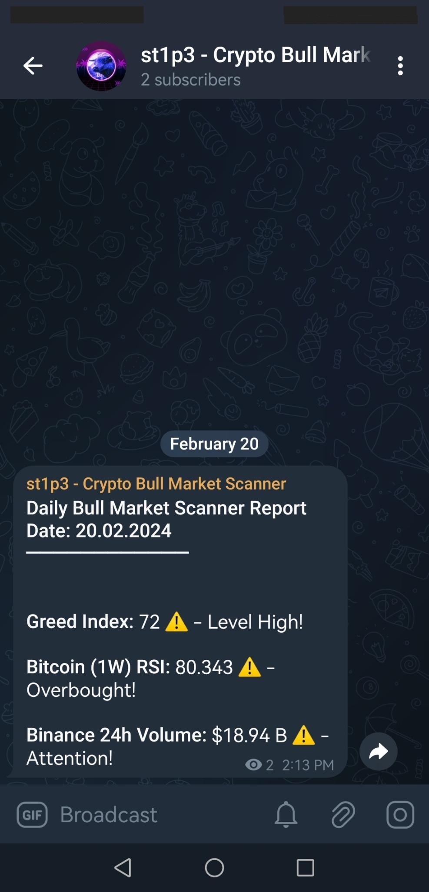

# bull_market_scanner
### Idea:
Scanning for potential ending of the crypto bull run.
### What this code does? 
You should set it up with Github Actions to start a scheduled job once a day. Then magic happens, it runs through script to check if there is any 
indicator that should be taken into consideration. If yes, then send all the info to the private Telegram channel.


## How to

1. Clone the repo
2. Install all dependencies:

```
pip3 install -r requirements.txt
```

3. Start creating your Telegram channel
4. Start a chat with BotFather on Telegram
5. Create new bot with `/newbot`
6. Save bot token
7. Add bot as admin to your channel
8. With GET request take telegram channel ID
This is the endpoint: `https://api.telegram.org/bot{your_bot_token}}/getUpdates`

It starts with -100...

And so on...

9. Further more currently there are three indicators implemented: 
- Crypto Greed Index 
- Bitcoin RSI
- Binance 24h Trading Volume

Of course these indicators have certain threshold limit, if the indicator value did not pass given limit,  
it will not include that indicator in the report. 

Indicator trigger:
- Crypto Greed Index will be triggered if the greed index is larger than 80 
- Bitcoin RSI will be triggered if the rsi value is larger than 90 
- Binance 24h Trading Volume will be triggered if the daily volume is larger than 60 Billion USD


This is how report looks like on the phone:
